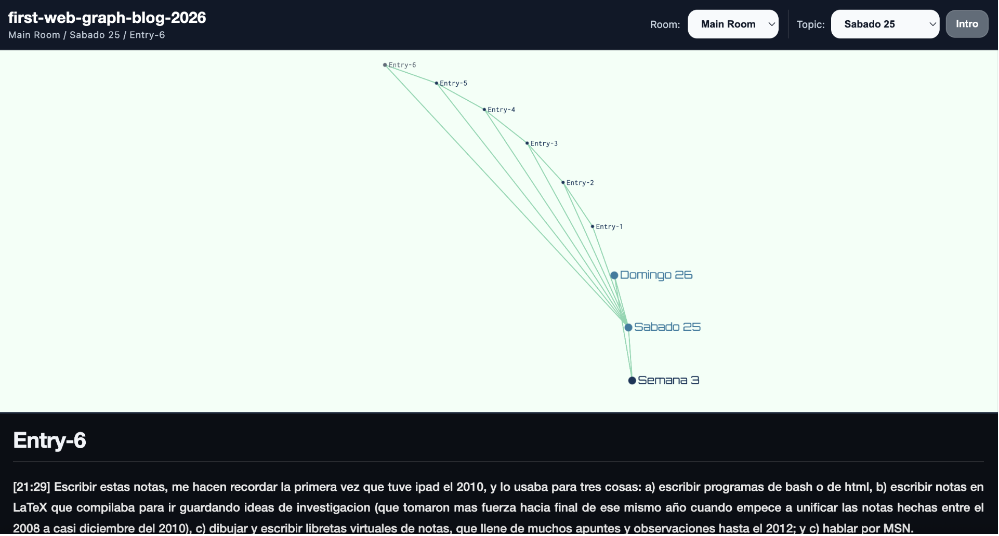
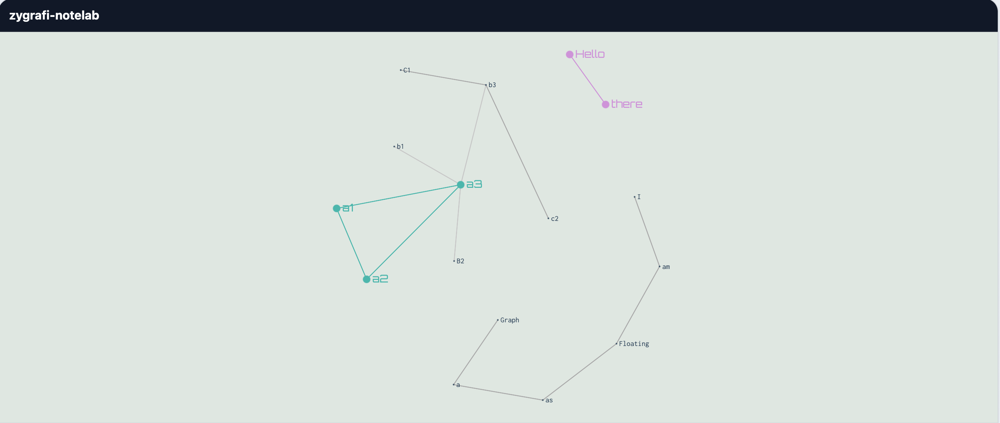

# Zykov

**A graph-oriented language for semantic curatorial publishing on the web.**

Zykov extends algebraic graph theory into semantic publishing.

Its companion compiler, **Zygrafi**, transforms `.zyk` scripts into:
- interactive semantic pages,
- navigable graph publications,
- interconnected entries,
- editorial semantic galleries,
- and curatorial hypertext systems.

<p align="center">
  
</p>

---

# Graphs as Expressions

In Zykov, graphs are written algebraically.

The expression itself becomes the topology.

<p align="center">
  
</p>

The above graph is expressed as
```zyk
a1*a2*a3 + a3*(b1+B2+b3)+b3*(C1+c2) + hello*there + I*am+am*Floating+Floating*as+as*a+a*Graph
```

## Semantic Graph

In Zykov, algebraic graph structures can become:
- semantic publications,
- curatorial interfaces,
- interconnected essays,
- and navigable narrative systems.

In the above example, two categories are created, as cat1 and cat2, for the clique a1*a2*a3 , and hello * there , so we have

```zyk
a1*a2*a3 :: cat1 + a3*(b1+B2+b3)+b3*(C1+c2) + hello*there :: cat2 + I*am+am*Floating+Floating*as+as*a+a*Graph
```
Where the categories are associated with colors to differenciate and filter.

---

# Live Playground

Copy and paste the following code:
```zyk
Zy = a1 * a2 * a3 + a3 * (b1 + b2 + b3)  + b3 * (c1 + c2) //+ path([hello,friend,have,a,happy,zykov,coding])
// this is a comment. Eliminate the comment above to see what Zy wants to say :)
```
And try Zykov directly in the browser by [Open Zygrafi NoteLab](https://anekemuthep.neocities.org/zygrafi-notelab). Press *clear*, *paste* the expression, then *run*  and Zy will greet you :). 

---

# Galleries made with Zykov

Here are some example galleries to explore:
1. [Computers, Anthropology and Sneakers: A Map Gallery](https://anekemuthep.neocities.org/sample-gallery-cas.build)
2. [Wipeout: Music, Lore and Tracks](https://anekemuthep.neocities.org/wipeout-music-lore-tracks.build)
3. [A modo de Blog Semántico (Abril 2026)](https://anekemuthep.neocities.org/first-web-graph-blog-2026-selected-entries.build)
4. [Zygrafi Newsroom - Edition III: A semantic News Gallery](https://anekemuthep.neocities.org/zygrafi-newsroom-edition-iii-week-signal.build)

---

# Installation

Go [here](https://github.com/Anekemuthep/Zykov/releases/tag/pre-release) and download zykov-lang.zip

## Requirements

- Node.js 18+
- npm
- Visual Studio Code (optional, for syntax highlighting)

---

## Install globally

From the root folder:

```bash
./setup.sh
```

This installs:
- `zygrafi`
- `zykov`
- VS Code syntax highlighting
- demo builds

If by any chance an error occur, in the same root of the zykov-lang file write:

```bash
sudo npm install -g .
```
and this should fix it.

---

# VS Code Syntax Highlighting

The project includes:
- `.zyk` syntax support
- the `Zykov Exhibit` theme

To manually install the extension:

```bash
./scripts/install-vscode-extension.sh
```

Then:
1. restart VS Code,
2. open a `.zyk` file,
3. select:
   `Preferences → Color Theme → Zykov Exhibit`

---

# Try this

Create a file called `hello-world.zyk`:

```zyk
Title = "Hello Zygrafi"

Background = "#dfe7e1"

Categories = {
  day1 -> "#4db6ac",
  semantic -> "#ce93d8"
}

NodesColor = {
  entries -> "#34495e",
  general -> "#5d6d7e"
}

EdgesColor = "#7ac9a2"

Layout = "forceAtlas"

Room = A * (B :: day1 + C :: semantic * collectionEntry)

roomData "Main Room" = {
  Title: "Hello Zygrafi",
  Text: "A semantic graph publication generated with Zykov."
}

entry A = {
  Title:"First Entry",
  Text:"This is a semantic publication node."
}

entry B = {
  Title:"Semantic Publishing",
  Text:"Zykov transforms graph structures into navigable curatorial spaces."
}

entry C = {
  Title: "Semantic Collections",
  Text: "Zykov alouds to create collections that group specific entries into shared space graph galleries."
}

entry collectionEntry = {
  Title: "Define by collection",
  Text: "In Zykov, when you connect a node with a collection or node associated to a specifica category, you automatically creatate a filter that aloud you to find it with all the nodes atached to another collection of the same category."
}

roomDesign Room = {
  Background: Background,
  Categories: Categories,
  Nodes: Nodes
}

gallery = {
  Room -> "Main Room"
}
```

Then compile:

```bash
zygrafi publish hello-world.zyk
```


---

# Example Projects

Included examples:
- `hello.zyk`
- `living-gallery.zyk`
- `wipeout_soundtrack.zyk`
- `note-lab-example.zyk`

---

# Learn More

If you want to learn more on Zykov, you can try the code for the tutorial:
```zyk
Title = "Hello Zykov — Learning by Building"

Background = "#dfe7e1"

Categories = {
  day1 -> "#4db6ac",
  semantic -> "#ce93d8",
  algebra -> "#7f8fb3",
  functions -> "#c8a46a"
}

NodesColor = {
  entries -> "#34495e",
  general -> "#5d6d7e"
}

EdgesColor = {"#7ac9a2"}

all = {
  Title:"Hello Zykov",
  Text:"This example is a small learning graph. Each node explains one part of the language while the graph itself is built from those same ideas.\n\nThe expression itself becomes the topology.\n\nTry changing categories, operators, or layouts and run the script again."
}

topic day1 = {
  Title:"First layer",
  Text:"This topic contains the first construction layer: simple nodes, visible relations, and basic graph composition."
}

topic semantic = {
  Title:"Semantic layer",
  Text:"This topic shows how nodes become entries with text, meaning, and navigable interpretation."
}

topic algebra = {
  Title:"Algebraic layer",
  Text:"Zykov uses + for union and * for join/link. The expression itself describes the structure of the graph."
}

topic functions = {
  Title:"Functional layer",
  Text:"Zykov can also use functions and guards to generate new graph structures from conditions."
}

// this is a comment. If you un-comment the lines below, Zy will join you in this manual. 
//Zy = a1 * a2 * a3 + a3 * (b1 + B2 + b3)  + b3 * (C1 + c2)

Manual = (A :: day1) * ((B :: semantic) + ((C + D) :: semantic) + ((Join + Union + Category) :: algebra)) + C * (Function + Guards + NewGraph) + Function * Guards + Guards * NewGraph //+ Zy 

Room = Manual |> forceAtlasLayout

roomData "Main Room" = {
  Title:"Hello Zykov",
  Text:"A semantic graph publication generated with Zykov.\n\nThis room is designed as a first hands-on example: you read the graph, click its nodes, and learn how the same script constructs the space you are exploring."
}

roomDesign Room = {
  Background: Background,
  Categories: Categories,
  Nodes: NodesColor,
  Edges: EdgesColor
}

entry A = {
  Title:"Start here",
  Text:"This is the first node.\n\nIn Zykov, a node can be part of an algebraic expression and also become an entry with its own text.\n\nTry changing A into another name and run the script again."
}

entry B = {
  Title:"Semantic publishing",
  Text:"Zykov transforms graph expressions into navigable semantic spaces.\n\nA graph is not only drawn. It becomes a publication."
}

entry C = {
  Title:"Union",
  Text:"The operator + combines graphs without forcing new connections.\n\nExample:\n\nA + B\n\nThis means A and B appear together, but they are not directly linked."
}

entry D = {
  Title:"Join",
  Text:"The operator * links graph components.\n\nExample:\n\nA * B\n\nThis creates a connection between A and B.\n\nWhen applied to larger expressions, * connects every vertex from one side to every vertex from the other."
}

entry Join = {
  Title:"The join operator",
  Text:"The expression:\n\nA * (B + C)\n\nmeans that A connects to both B and C.\n\nThis is one of the most important algebraic gestures in Zykov."
}

entry Union = {
  Title:"The union operator",
  Text:"The expression:\n\nB + C\n\nplaces B and C in the same graph without connecting them directly.\n\nThis is useful for creating groups, collections, and parallel semantic elements."
}

entry Category = {
  Title:"Categories",
  Text:"The operator :: assigns a semantic category to a graph.\n\nExample:\n\nA :: day1\n\nCategories become filters, colors, and interpretive layers in the final publication."
}

entry Function = {
  Title:"Functions",
  Text:"Functions allow you to reuse construction patterns.\n\nFor example, a function could receive a graph and return a modified graph.\n\nThis lets Zykov move from writing individual graphs to designing graph-generating procedures."
}

entry Guards = {
  Title:"Guards and conditions",
  Text:"With guards, a function can choose different constructions depending on a condition.\n\nExample:\n\nbuild(x) = x == 1 -> A * B | else -> A + B\n\nThis means: if the condition is true, create one structure; otherwise, create another.\n\nWith guards, Zykov can generate networks from rules."
}

entry NewGraph = {
  Title:"New graph from rules",
  Text:"If you define functions with guards and apply them to graph expressions, you can create new networks conditionally.\n\nThis is where Zykov becomes more than notation:\n\nit becomes a small language for constructing semantic worlds."
}

gallery = {
  Room -> "Main Room"
}
```

---

# Available layouts

```zyk
Layout = "circular"
Layout = "grid"
Layout = "force"
Layout = "forceAtlas"
Layout = "random"
Layout = "concentric"
Layout = "radial"
Layout = "arc"
```

Layouts in Zykov are not only geometric arrangements:
they are reading strategies for semantic navigation.

---

# License

Zykov is licensed under the GNU AGPL-3.0.

This guarantees that:
- derivative systems remain open,
- network-based deployments preserve attribution,
- and semantic publication ecosystems derived from Zykov remain part of the open commons.

---

# Credits

Zykov language developed by Alfonso Bustamante.

<p align="center">
  
</p>

Based on the paper:

> *A Zykov Algebra Approach to Clique Propagation*  
> Discrete Mathematics, Algorithms and Applications  
> World Scientific, May 2025.

Repository:
https://github.com/Anekemuthep/Zykov

Website:
https://alfonsobustamante.com/

Published article:
https://www.worldscientific.com/doi/10.1142/S1793830925500806

Zykov and Zygrafi use the graph visualization technology developed by Sigma.js.

Sigma.js was fundamental in the construction of the visual and navigable layer of the project.

- Sigma.js → https://www.sigmajs.org/
- Graphology → https://graphology.github.io/
